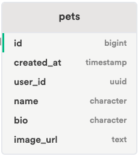

# Pet Lovers Supabase: Multi-page CRUD Add/List

## The Golden Rule:

🦸 🦸‍♂️ `Stop starting and start finishing.` 🏁

If you work on more than one feature at a time, you are guaranteed to multiply your bugs and your anxiety.

Work incrementally, being fully done, one small step at a time!

## Demo

Use [this template](https://github.com/alchemycodelab/web-finish-pet-lover) for this deliverable.

## Live Example:

[Demo](https://alchemy-web-pet-lover.netlify.app/)

## Setup Supabase

You have three options for which supabase project to use:

1. Use the shared supabase project by sticking with the `URL` and `KEY` already in `fetch-utils.js`
1. [Create a new supabase project](https://github.com/alchemycodelab/student-resources/blob/main/resources/supabase/new-project.md) and [Run the `db.sql` setup scripts](https://github.com/alchemycodelab/student-resources/blob/main/resources/supabase/run-setup-scripts.md)
1. [Run the `db.sql` setup scripts](https://github.com/alchemycodelab/student-resources/blob/main/resources/supabase/run-setup-scripts.md) against an existing supabase project

Having your own project will enable you to inspect the result of uploading images and inserting data rows. If choosing option #2 or #3, make sure to [update your `URL` and `KEY`](https://github.com/alchemycodelab/student-resources/blob/main/resources/supabase/client-url-api-key.md)

## Requirements

For this deliverable, use the provided application code. Auth is already provided.

Your job is to add:

-   A. Finish image upload of a pet
-   B. Add a new pet to the database
-   C. Get pets for the home page list

### Part A: Upload Pet Image

-   `pet-editor.js` - import upload image function, on submit upload the image

The form will upload the image, but won't be saving anything yet, so nothing will "happen" in the UI. Assuming you created your own project, you can look in the`images` storage bucket to see if the image uploaded successfully. If you are using the shared db, you should check your network tab

### Part B: Add a Pet

-   `fetch-utils.js` - export a function to create a pet
-   `pet-editor.js` - import fetch-util function, on submit handle inserting the pet

Assuming you created your own project, you can look in the `pets` table to see if the data inserted successfully. If you are using the shared db, you should check your network tab

### Part C: View Pet List

-   `fetch-utils.js` - export a function to get the pets
-   `app.js` - import fetch function and complete the load event
-   `render-utils.js` - set the elements with the corresponding state

Your UI should be showing visual results.

## Schema

### Storage bucket

The name of the storage bucket is `images`

### Data Model

Here is the schema for the `pets` table in supabase:

## Rubric

The following is required for your assignment to be graded:

-   PR open from `dev` to `main`
-   PR Passes CI (lint + tests)
-   PR preview on netlify

| Commit with Working Feature... | Points |
| ------------------------------ | -----: |
| Upload Pet Image               |      3 |
| Add a Pet                      |      3 |
| View Pet List                  |      4 |
